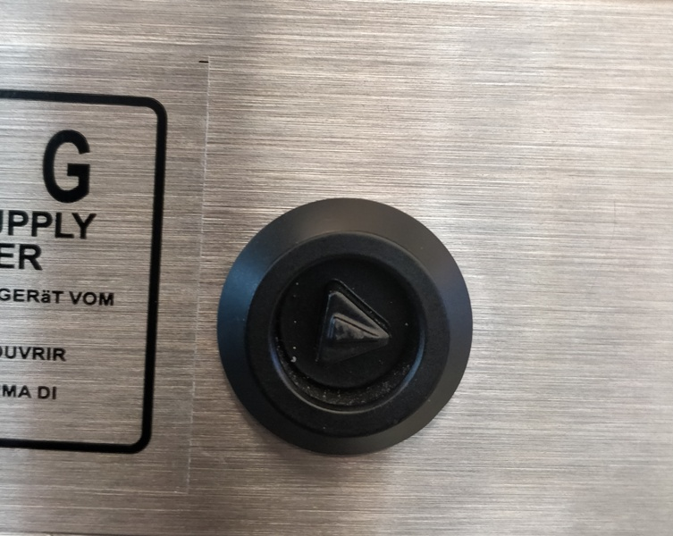
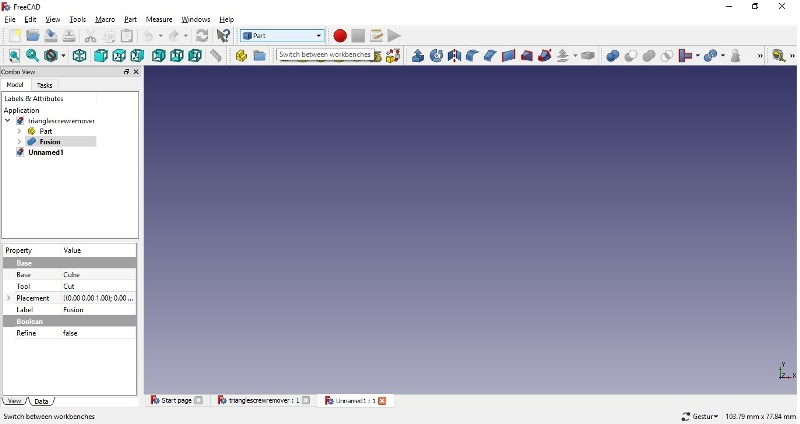
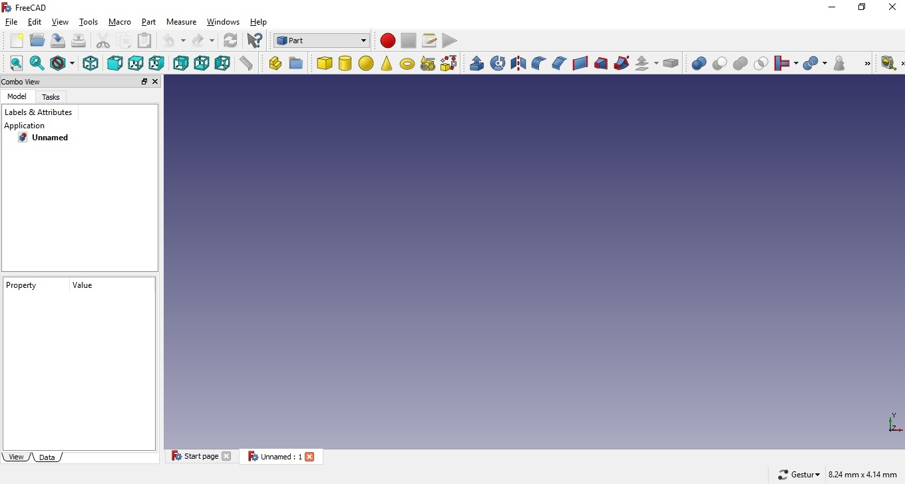
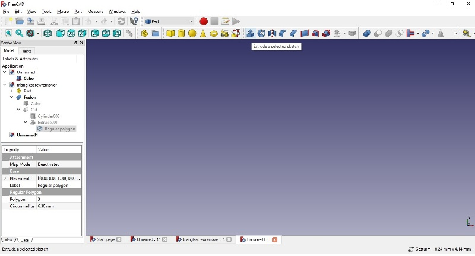
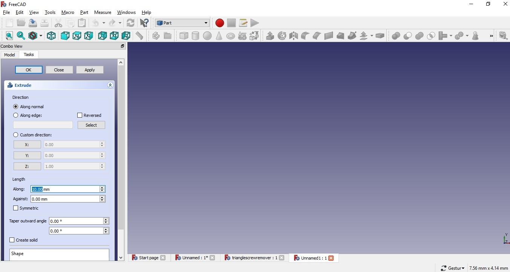
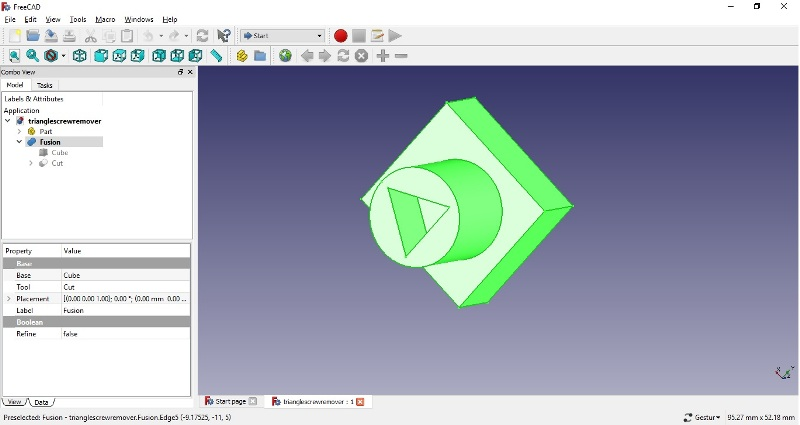
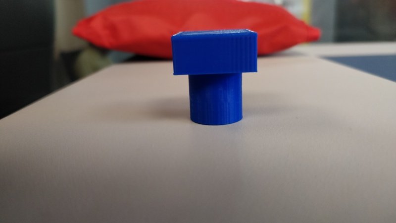
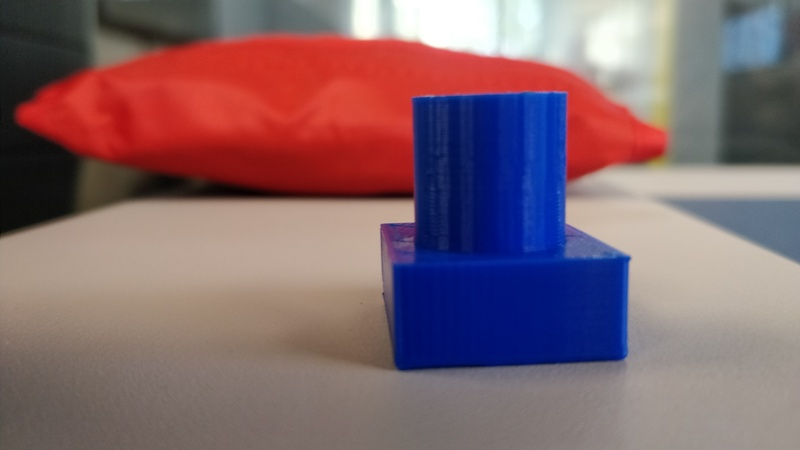
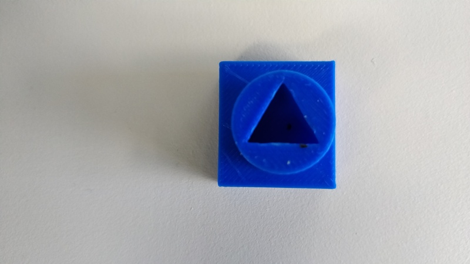

# 3-D Printers 

3D printing is any of various processes in which material is joined or solidified under computer control to create a three-dimensional object, with material being added together (such as liquid molecules or powder grains being fused together), typically layer by layer. The precision, repeatability and material range have increased to the point that 3D printing is considered as an industrial production technology, with the name of additive manufacturing. 3D printed objects can have a very complex shape or geometry and are always produced starting from a digital 3D model.

The make installed at FAB Lab is Sindoh. It is a basic 3-D printer which works on the principle of Fused Filament Deposition. It is a device which works on 3 axis and provides the required shape by the means of deposition of the material used for printing.

## Experiment-1- (Printing of Tweeser Blade Holder in 3D Printer)

3-D Printing

Further, hands-on 3D Printers was done by a team of 10 members. The 3 D printer used was 3D WOX (Sindho). During the practical, the basic operation of the 3D printer was demonstrated. On the touch scree panel 4 options were available like cartridge, print, settings and info. Initially the process of cleaning and maintenance to 3D printer was demonstrated. The cartridge used in 3 D printer is PLA (Poly Lactic Acid). While performing the maintenance of the 3D printer the PLA has to be removed from the printer which was done by the team. The cartridge contained a wire of PLA rolled in it. 

## PLA Roll

The rolling of the wire in the cartridge has to be done in such a way that there is proper tension in the roll. During the maintenance of the roll of the cartridge, the team was informed that, if any bend was found in the PLA, that portion might not provide a proper printing. The team during the maintenance of the PLA found a bend and that small portion of the bend was removed from the roll.

## Bend Piece of PLA Roll

 Further the roller was fitted into the cartridge. It is worth noting that, while fitting the roll in the cartridge any part of the roll should not be out of the cartridge. The cartridge was the inserted in the 3D printer. Further, a section were the collection of wasted PLA which the roller uses for self cleaning was demonstrated and the process to clean it was shown. The cartridge is attached with a chip which contains all the information about the cartridge like length of the roll, color and physical properties of the filament. The diameter of the filament in the cartridge was 1.75 mm.

The device was now ready to print. The team was asked to print anything which can be of useful nature. The team decide to produce a clip which can be able to hold the loose roll of PLA in the cartridge when it is not in use. The team found the image of the clip on the website https://thingiverse.com which was downloaded and further was sliced using Sindoh software. Proper orientation of the clip was selected and the item was processed to be printed on the 3D printer. The team performed the task and the first test product of FAB Lab, STPI Bhubaneswar was produced.

 Fabricated PLA Roll Clip produce by 3D Printer

Further, each trainee was asked to produce a separate material using 3D printer using all information provided during the fabrication. 

I had prepared a tweeser blade holder used to remove the vinyl pieces cut by vinyl cutter. The 3D image of the tweeser blade holder was obtained from https://thingiverse.com. Further, .spl file of the same was downloaded as for creating the 3D picture this image would be used in Sindoh software. The software is used for creating layer in the image to be printed. In the software, there is an option of viewing the layer by layer printing which would be done by the 3D printer. The green segment would show the area were no printing would be done. Based on the structure and orientation of the material to be produced certain areas has to be decided were the base should be given. 

I had created the tweeser blade holder by giving a print command through my laptop connected wireless through printer. It took 1 hr and 10 minutes for the Sindoh 3D WOX printer to print my fabricated material.

The base prepared by the 3D printer during the fabrication of Tweeser Blade Holder is shown below.

After the printer has completed the printing, the material is removed after cooling down with proper tool. Further, the base has to be cleaned before further use.

During the experiment I had also explored that the print can be queued in the printer if the printer is busy in printing.

Pictures clicked during the 3-D printing of my tweeser blade holder is attached below

## Experiment-2- (Designing and Printing of Triangular Screw Driver used of the screws in Purex)

3D-Design:- To design the Triangular Screw Driver to be used for opening the screws in Purex, the software used was FreeCad. This software is used to design any 3D object which can be used for some specific purpose which in my case was the triangular screwdriver. 

CSG (Contructive Solid Geometry) is used for creating 3D images. There are some basic structures for 3D Designing which are solid cube, solid sphere, solid cone, solid cylinder.

The screw for which the screw driver was to be used has shown below:-

 

On opening the FreeCad software on the selection menu we have to select switch between workbenches and select 'part' as shown in the image below:-

On selecting 'Part' the basic designs like solid cylinder, solid cone etc. can be seen as mentioned in the image below:-

Further, we can select any shape and can start working on our design. The few points while operating on FreeCad has to be kept in mind which are as under:-

(i) The screen of freecad has to be maximized while working and on the right bottom of the screen under settings which is in scroll down format "Gesture" has to be selected.

(ii) Further, the use of mouse while working is very important as the image has to be seen from all directions while working which is very difficult without mouse.

(iii) Prior to drawing of a 3D image in freecad, it is necessary that we analyse the object to be made and the process by which it would be made. To make it easy, it is a good practice to draw the required image on a piece of paper before working on freecad. 

(iv) Basic concepts of boolean algebra should be known so that we can design either by union, difference etc. which are the basic concepts of boolean algebra.

For making the design, I had used a solid cube, a solid cylinder and a triangular shape to be cut from the cylinder so that the screw driver may be made.

The step by step process by which I made my design is as under:-

(i) Initially the dimensions of the 3 designs were taken which included the diameter of the circle which is 16.4 mm, the depth of the screw which is about 8 mm and the size of each side of the triangle which is 10 mm each.Circum radius of the triangle was required to be found which was done with the formula r= 2/3 of height. The sides of the triangle were known and we know that the angle of the equilateral triangle is 60 degree each and hence to find the circum radius we used the formula r= h/b ie. tan 60 degree = h/5. By this we were able to find the complete height and the 2/3 portion of the height provided the circum radius. Since the circum radius was taken according to the exact measurement of the triangle we had the provision to increase the size of circum radius as the diameter of the circle designed was perfect to be fitted along the depth. Since the circum radius which was calculated at 5.77 mm was increased to 6.30 mm so that the screw driver can easily hold the screw. The cube was used to provide support to the screw driver which has to be a little larger that the cylinder

(ii) I have used a cube of dimension 24mm x 22mm x 10mm (Length x width x height) along with a cylinder with dimensions Radius 8 mm, height 24 mm and angle 360 degree.

(iii) Further along the cylinder, I had cut an triangle with an circum radius to 6.30 mm.

(iv) I have fused the cubical base with the cylinder using boolean algebra and selecting the first shape as cube and second shape as cylinder. 

(v) Further , the triangular shape has to be extruded from the fusion by the selecting the 'Extrude the selected sketch' as shown in image below:-

 

(vi)On selecting the 'Extrude the selected sketch' a dialog box would be opened in which proper dimensions has to be selected and the extrude has to be done 'along normal' and press apply and OK. The dialog box of 'Extrude the selected image' is shown in the image below:-

(vii) The required 3D image would be made is all the process are completed properly. The 3D design of my 'Triangular Screw Driver' can be seen in the image below:-

(viii) The design was then exported to .stl format and then uploaded to 3DWOX (sindoh) for 3D printing. While uploading the image in the 3D printer, the G-code of the image was saved so that it can be used in future as well. Normal 3D printing was selected and it took almost 35 minutes for the 3 D printer to print my Triangular Screw Driver. The screw driver was tested on the Purex purifier to test whether it was working and it was found that the triangular screwdriver was working properly and it was able to open and close the triangular screw. 

Hence, my first useful contribution of the Fab Lab established at STPI Bhubaneswar was handed over to my mentors to be put to proper use in Fab Lab.

Some images of my 3D printed triangular screw driver can be seen below:-

Result:-

The experiment was successfully completed with the desired results.