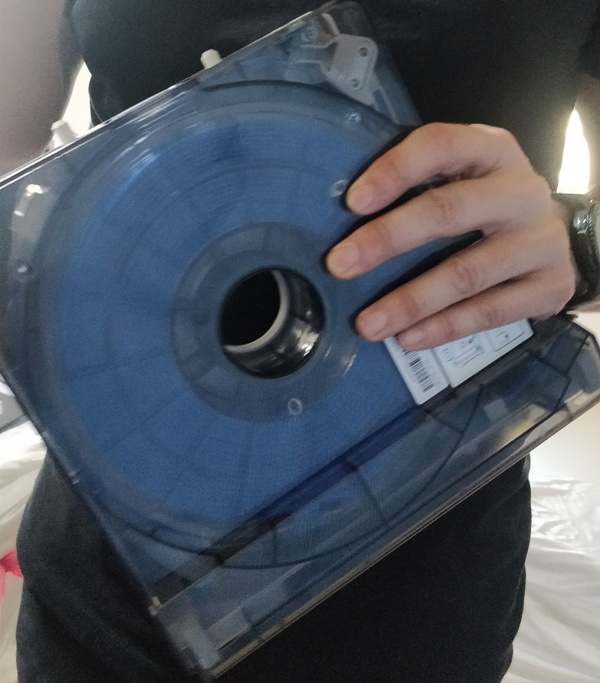

# 3-D Printers 

3D printing is any of various processes in which material is joined or solidified under computer control to create a three-dimensional object, with material being added together (such as liquid molecules or powder grains being fused together), typically layer by layer. The precision, repeatability and material range have increased to the point that 3D printing is considered as an industrial production technology, with the name of additive manufacturing. 3D printed objects can have a very complex shape or geometry and are always produced starting from a digital 3D model.

The make installed at FAB Lab is Sindoh. It is a basic 3-D printer which works on the principle of Fused Filament Deposition. It is a device which works on 3 axis and provides the required shape by the means of deposition of the material used for printing.

## Experiment-1 - 

3-D Printing

Further, hands-on 3D Printers was done by a team of 10 members. The 3 D printer used was 3D WOX (Sindho). During the practical, the basic operation of the 3D printer was demonstrated. On the touch scree panel 4 options were available like cartridge, print, settings and info. Initially the process of cleaning and maintenance to 3D printer was demonstrated. The cartridge used in 3 D printer is PLA (Poly Lactic Acid). While performing the maintenance of the 3D printer the PLA has to be removed from the printer which was done by the team. The cartridge contained a wire of PLA rolled in it. 

## PLA Roll

The rolling of the wire in the cartridge has to be done in such a way that there is proper tension in the roll. During the maintenance of the roll of the cartridge, the team was informed that, if any bend was found in the PLA, that portion might not provide a proper printing. The team during the maintenance of the PLA found a bend and that small portion of the bend was removed from the roll.

## Bend Piece of PLA Roll

 Further the roller was fitted into the cartridge. It is worth noting that, while fitting the roll in the cartridge any part of the roll should not be out of the cartridge. The cartridge was the inserted in the 3D printer. Further, a section were the collection of wasted PLA which the roller uses for self cleaning was demonstrated and the process to clean it was shown. The cartridge is attached with a chip which contains all the information about the cartridge like length of the roll, color and physical properties of the filament. The diameter of the filament in the cartridge was 1.75 mm.

The device was now ready to print. The team was asked to print anything which can be of useful nature. The team decide to produce a clip which can be able to hold the loose roll of PLA in the cartridge when it is not in use. The team found the image of the clip on the website https://thingiverse.com which was downloaded and further was sliced using Sindoh software. Proper orientation of the clip was selected and the item was processed to be printed on the 3D printer. The team performed the task and the first test product of FAB Lab, STPI Bhubaneswar was produced.

 Fabricated PLA Roll Clip produce by 3D Printer

Further, each trainee was asked to produce a separate material using 3D printer using all information provided during the fabrication. 

I had prepared a tweeser blade holder used to remove the vinyl pieces cut by vinyl cutter. The 3D image of the tweeser blade holder was obtained from https://thingiverse.com. Further, .spl file of the same was downloaded as for creating the 3D picture this image would be used in Sindoh software. The software is used for creating layer in the image to be printed. In the software, there is an option of viewing the layer by layer printing which would be done by the 3D printer. The green segment would show the area were no printing would be done. Based on the structure and orientation of the material to be produced certain areas has to be decided were the base should be given. 

I had created the tweeser blade holder by giving a print command through my laptop connected wireless through printer. It took 1 hr and 10 minutes for the Sindoh 3D WOX printer to print my fabricated material.

The base prepared by the 3D printer during the fabrication of Tweeser Blade Holder is shown below.

After the printer has completed the printing, the material is removed after cooling down with proper tool. Further, the base has to be cleaned before further use.

During the experiment I had also explored that the print can be queued in the printer if the printer is busy in printing.

Pictures clicked during the 3-D printing of my tweeser blade holder is attached below

