## Desktop Milling Machine (SRM-20)

The technique of printing a prototype through Desktop Milling Machine is also known a Rapid Prototyping. Rapid prototyping is a group of techniques used to quickly fabricate a scale model of a physical part or assembly using three-dimensional computer aided design data. 

It is also called Mono CNC or Prototype Printer. 

To understand the proper work of Desktop Milling Machine, following task was executed:-

## Task- Designing prototypes and printing in Desktop Milling Machine SRM-20.

The aim of the experiment was to design a personalized design to be printed in a mono CNC. The software used for designing the prototype for the experiment was Kicad. It is a software which assists in making the desired designs. For designing kicad is used in following steps:-

(i) Open the kicad software and start a new project.

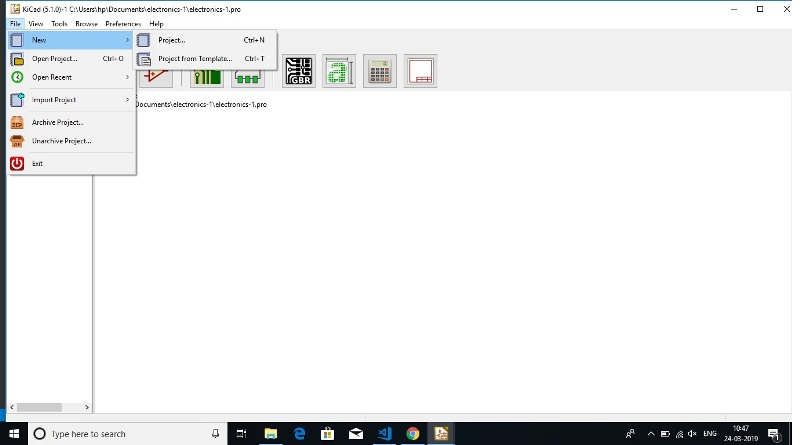

(ii) The PC would ask for the location of the project. It should be kept in mind that all the kicad designs and supporting documents are to be kept in a single folder for ease of operations.

(iii) Once the location is selected open kicad Schematic layout editor to start designing new schematic.

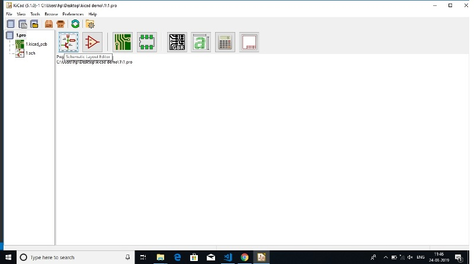

(iv) On starting the new schematic a new window would be opened named 'Eeschema'. On which on the right side of the screen there is a symbol named 'place symbol'.

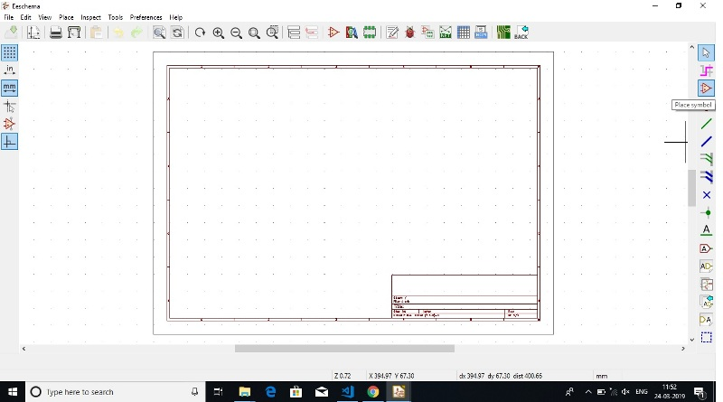

(v) One after clicking the 'place symbol' icon and clicking on the screen a panel for selecting the item would appear through which the items required for the designing the prototype may be selected.

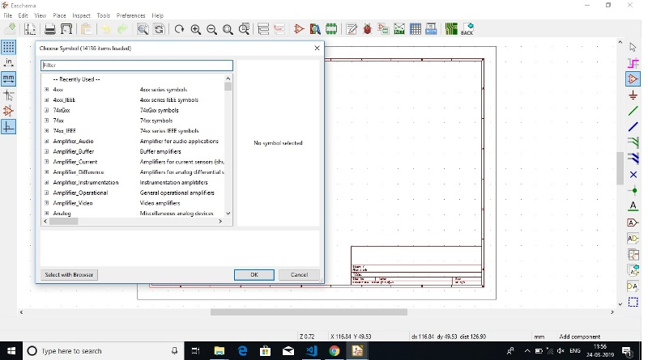

(vi) I had designed the following prototype:

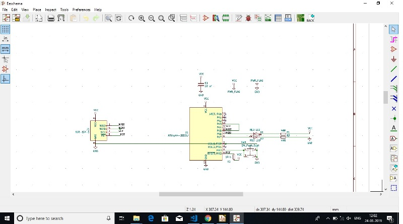

(vii) After thr prototype is designed it is a required to annotate schematic symbols using the following option.

(viii) After Annotating the schematic, there is a symbol for 'performing electrical rule check' which confirms the proper electrical connections in the schematic.

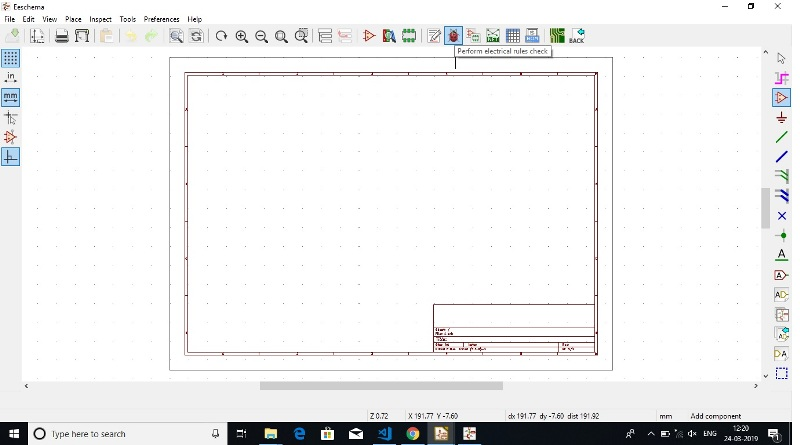

(ix) The next set is to 'Assign Foot Prints' to the schematic made

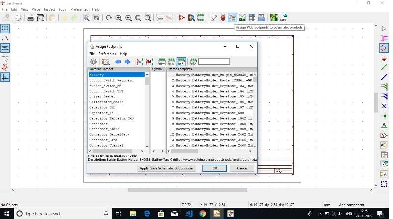

(x) The next step is to generate 'Net List' and save it is the same folder prepared for the project.

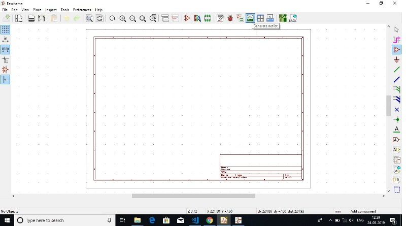

(xi) Further, the design is forwarded to be processed for "layout design for Printed Circuit Board of the schematic designed.

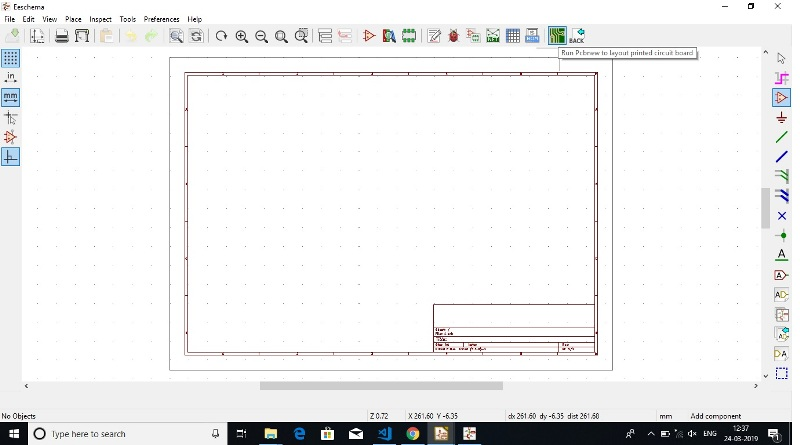

(xii) Further the schematic diagram has been imported to the PCB designing and my prototype was ready to be printed.

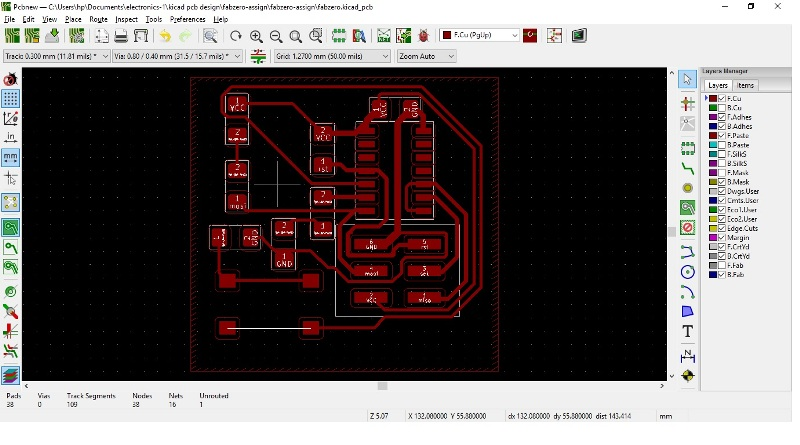

(xiii) After finishing the design of the PCB, on the right side of the panel, there is an option of edge cut. Along with that, option of adding graphic line has to be selected so that the border of the PCB design can be created. The dimension of the border has to be 0.8 mm which is selected according to the milling bit. 

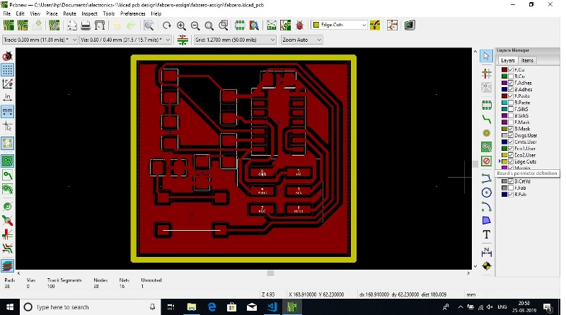

(xiv) Once the boundary is created, this can be saved through file by plotting command. While selecting the same there would be some options to select out of which F.Cu and Edge.cuts has to be marked. The plot format has to be saved in .svg format. Further, under the general options 'exclude pad from silk screen ' and 'negative plot' has to be ticked leaving all the other as unchecked.

(xv) After the above step the plot can be save in .svg format in the folder were the designing of the PCB has been done. Two .svg images would be saved on the location as mentioned by the user. For the ease of operations, it is recommended that the images may be save in the same folder were all the other operations of the designing part has been done.

(xvi) The image has to be exported in .png format at 2000 dpi for clear picture. Further, for printing the image of circuit board the .png image has to be converted into .rml format.

*Note:- (i) The white portion in the png image would be kept and black portion would be removed.
   
(ii)The general rule of milling in mono CNC is that if the diameter of milling bit is 0.8 mm, the milling bit will go on till 0.4 mm down in the Z-axis towards the plate in which the PCB board is printed. 

(xvii) For converting the image in .rml format, http://fabmodules.org/ is used. While browsing on the website initially the input format has to be selected. Which in our case would be the .png file converted for preparing the traces and cuts. On selecting the image, it would further ask for output which has to be selected as Rolland mill (.rml). Further it would ask for the process which is to be selected as PCB Traces (1/64) for tracing and PCB Outline (1/32) for cut.

(xviii) Once the above process is complete, the specifications of the print has to be selected on the right side in the panel were input and out put has to be selected. For getting a clear print. the dpi has to be selected as 2000 dpi in the input. Under the same head, we can see the size of the image as well which is 41.38 x 38.84 mm in our case.

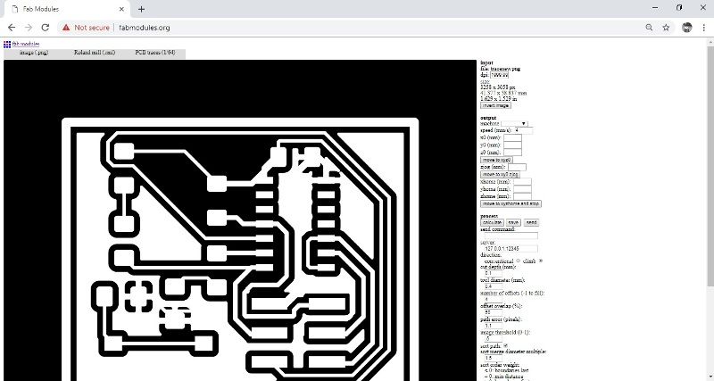

(xix) Further, the output of the machine has to be selected which is SRM-20 in our case with       4 mm/s speed, x0, y0 and z0 set at 0 and zjog set to 2 mm. Zjog is the maximum distance the milling bit will move from the frame in z direction.

(xx) After completing the above set up, we have to calculate and save the same.

(xxi) The process has to be done for both .png file of traces and cuts and has to be exported in .rml file prior to printing. 

*Note:- For the cut.png, the image, the has to be inverted while inserting values in input which is a very necessary process.

(xxii) While printing first the traces would be printed following with the cut after which the printed pcb can be removed from the mono cnc or desktop milling machine.

(xxiii) For printing the PCB in mono CNC v panel of SRM-20 has to be opened and X-axis, Y-axis and Z-axis has to be set-up.  For setting-up the origin the machine has to be moved in X and Y axis this can be done by selecting the speed as continuos mode, x100 speed, x10 speed or x1 speed. X and Y axis can be moved in continuos mode but the Z axis has to be moved very carefully as this could damage the milling bit. The speed for moving the milling bit should not be selected in continuos mode. It should be    x 100 speed or more preferably x 10 speed to protect the milling bit from breaking. 

(xxiv) The user coordinate on the left hand side of the panel has to be set to 0 by setting origin on the right side of the v panel dashboard by clicking set origin point (user Cordinates). First X/Y should be set and then Z.

(xxv) After setting-up the origin the milling bit which is moving in the Z-axis has to be moved 2 mm in upside direction. The set-up would be complete. The setting of v panel of SRM 20 is shown in the image below:-

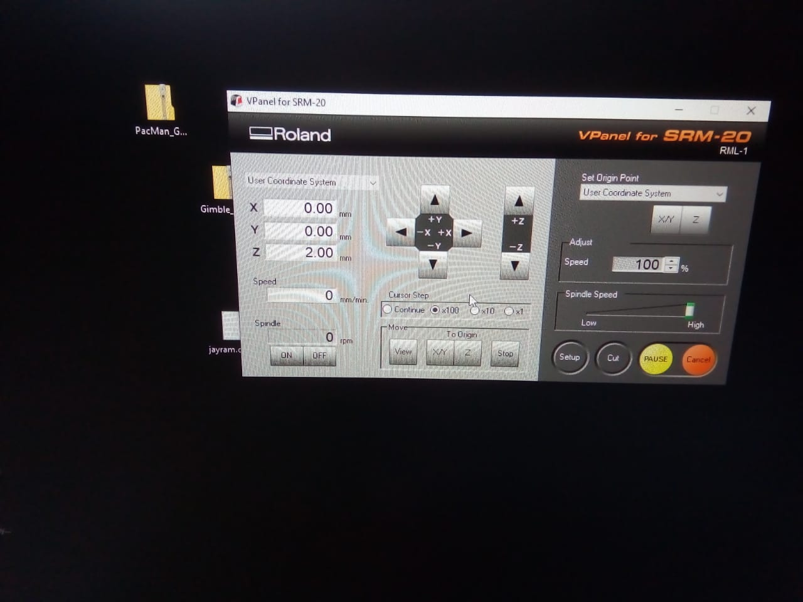

(xxv) Further, there is an option of machine coordinates in the left side drop down list which has to be noted after setting the user coordinates to origin. This is because if during the process of milling PCB, the user coordinates are missed, the machine can be brought back to the origin by using Machine coordinates which were recorded while setting the user coordinates to the origin.

(xxvi) Further, the trace bit is set in the milling machine which is /64. This would cut the traces of the PCB design.

(xxvii) Next step is to load the trace file through V-panel of SRM-20 and further click the output button on the SRM-20 v-panel. The milling bit would start cutting  the traces of the PCB design.

(xxviii) Once the traces are done, the milling bit is to be replaced with /32 milling bit which is used to cut the PCB. After changing the bit, the milling bit has to be moved again to the origin set earlier and further load the cut file on the SRM-20 V-Panel and click out put. The milling bit would start to cut the PCB. After the cut process is complete the PCB can be removed from the sacrificial board. 

## Error experienced while printing the PCB on the mono CNC-

While printing my the PCB, some traces were missed. The picture PCB with the error may be seen in the image below:-

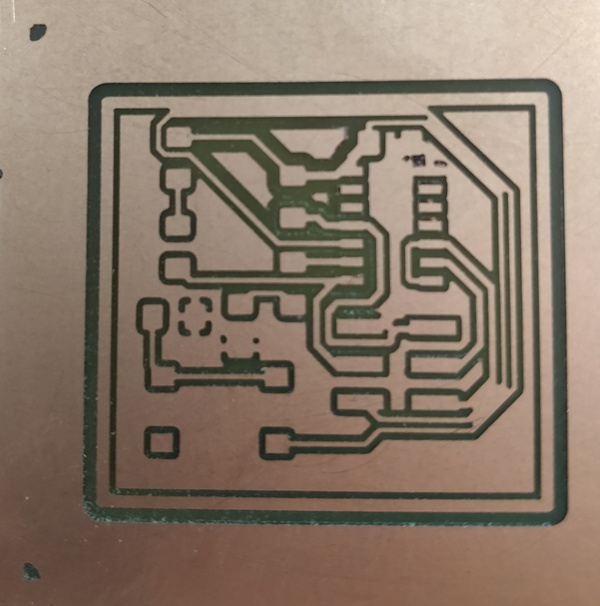

It can be seen in the image that, some traces are missed. It can be compared by .png image or kicad design of the PCB in above images.

This error occurred since the milling bit cannot process the traces as the space  the two traces was too less. It occurred due to the issue in design in which may be the size of the milling bit selected was not correct. To correct the error, we can select the size of the milling bit 0.02 mm less while selecting the bit size during conversion of .png file in .rml by  http://fabmodules.org/. On the right side of the panel there is an option of selecting the tool diameter which can be feeded 0.02 mm less. This option should not be practiced regularly and the error should be corrected in the kicad while designing PCB.

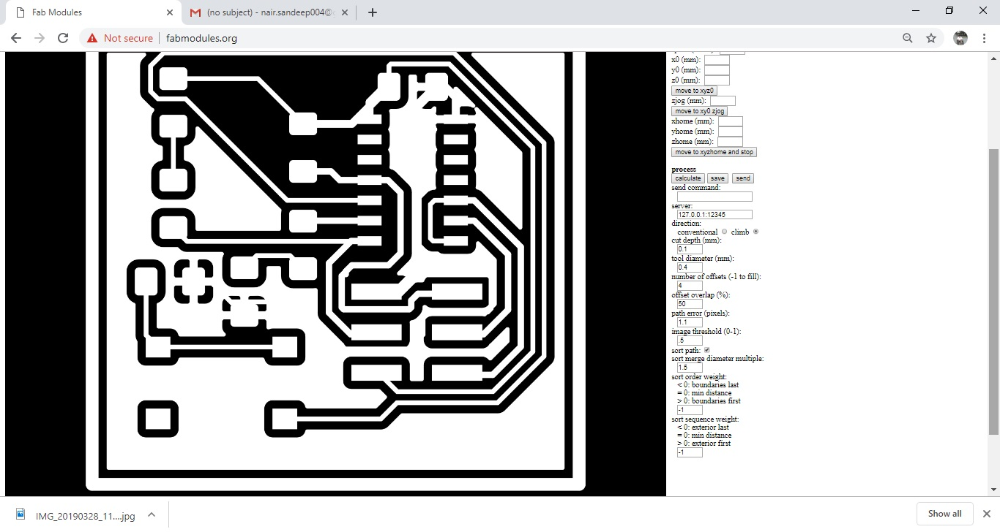 

I had corrected the tool diameter and again printed the PCB which was then printed correctly.

Further all the active and passive components as per the design was soldered and the PCB was check to be found in working condition.

