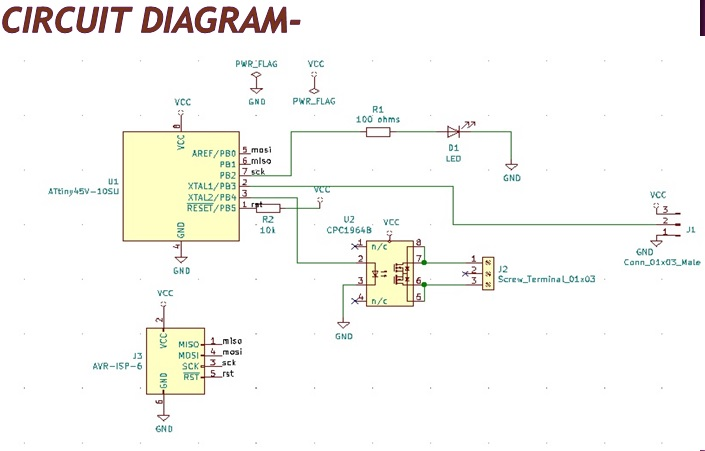
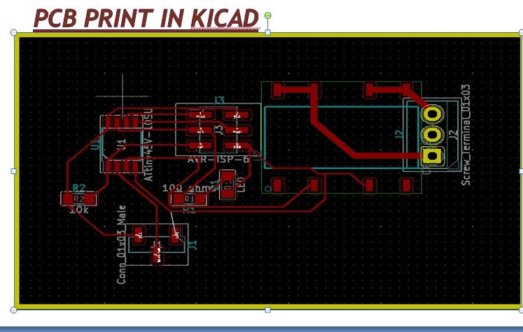
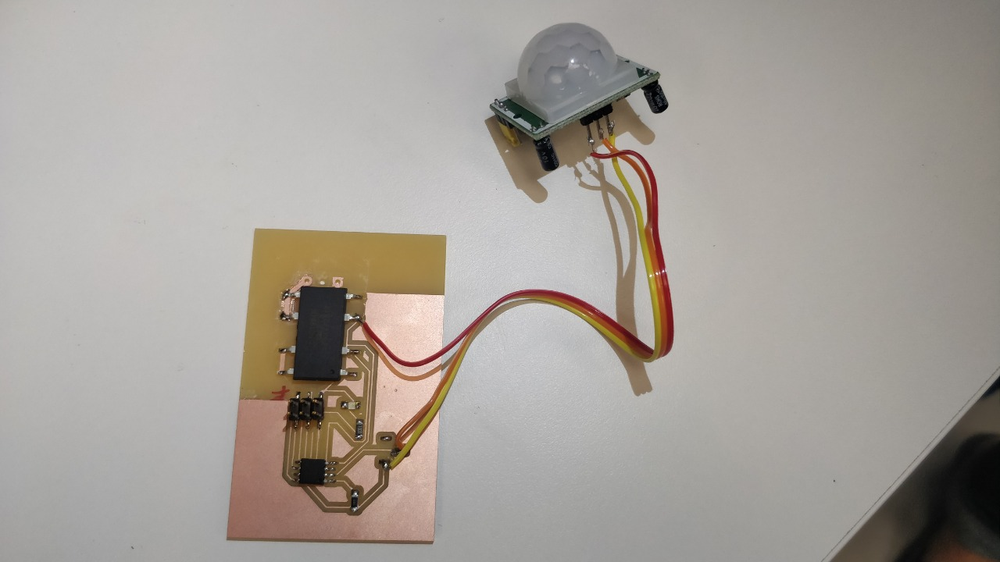
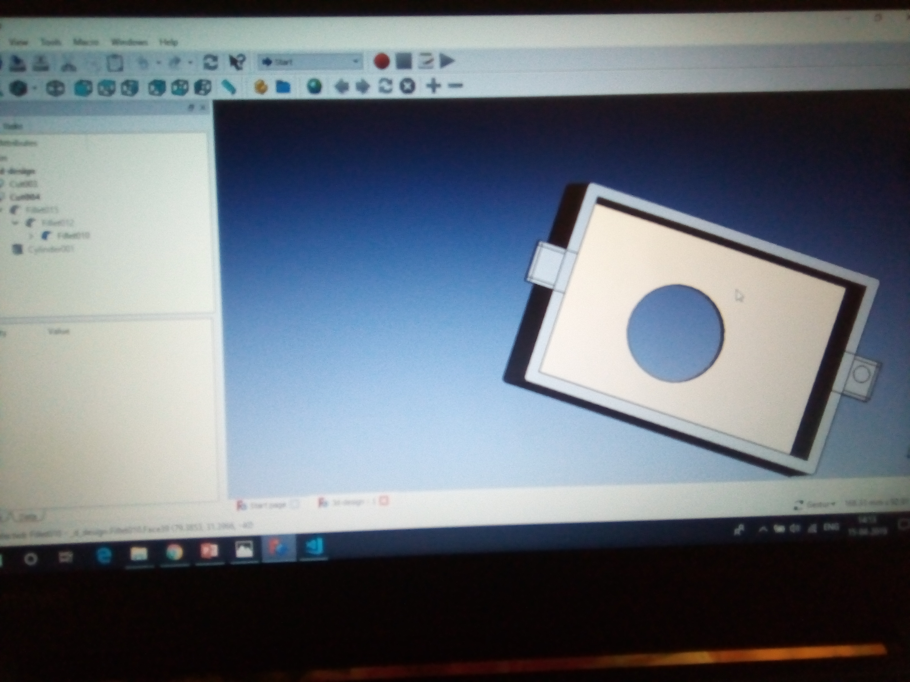
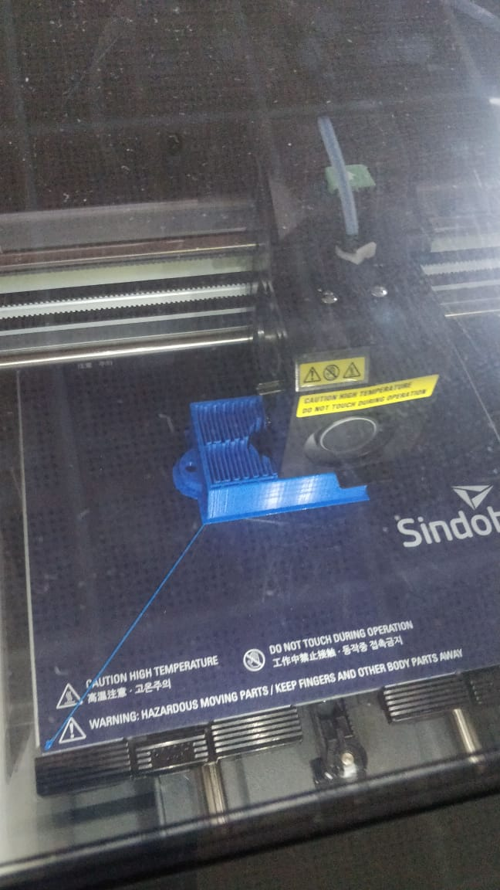

## Final Project - (Automated Room Lighting System)

### Project Guide-

Francisco Sanchez Arroyo- Mentor- FABLAB STPI Bhubaneswar

Sibu Saman- Mentor- FABLAB STPI Bhubaneswar

### Project Implementation Group-

Sandeep Nair- Senior Technical Assistant (STPI Bhopal)

Suvadip Barua- Senior Technical Assistant- STPI Kolkata

### Aim of the Project

To design, fabricate and prototyping of "AUTOMATED ROOM LIGHTING SYSTEM".

### Objective of the project:-

* The objective of this project is to make an Automated Room Lighting System which can automatically turn ON the lights by detecting the presence of human and turn OFF the light when no human presence is detected.

* This project is useful since it aims towards conservation of energy which is most important. 

* The product would be useful in the those areas which require lights only when it is in use for eg: Staircase area, washrooms etc.

### Working of the Project:-

* The circuit works on two conditions - one is presence of light in its location and second is presence of human being, only when these two conditions are met, the controller turns the backup light ON.

* These condition for operation of the product is tested by sensors which is PIR Motion sensor module. 

* PIR (Passive Infrared Sensor) is basically an IR (Infrared Receiver). It consists of sensitive IR receivers which detects the IR (Infra Red) rays in its region. Every living organism emits IR rays and so is the  case with human body. Whenever a there is a human in the sensor module region it detects the presence of IR rays. 

* Further, an LDR (Light Detecting Resistor) can be used with the product. When the light falling on the LDR is low, the resistance of the LDR will be high. When the light falling on LDR is high the resistance across terminals of LDR will be very low compared to low light resistance. so that, it may detect the light as well.

* On detecting the motion, the product switches the lights-ON. The process is reversed when no motion is detected and the microcontroller switches OFF the light.

### Components Used:-

1. Micro-controller- At tiny-45 10 SU- 1nos.
2. ISP Header – 1 nos.
3. PIR Sensor – 1 nos.
4. 100 ohm resistor- 1 nos.
5. 10 K resistor- 1nos.
6. LED- 1 nos.
7. 1 x 3 male Connector- 1nos.
8. Solid State Relay- 1nos.

### Procedure:-

The design of the circuit was prepared on Kicad using all the components as mentioned above. First the schematic was prepared followed by PCB design. The pictorial representation of schematic and PCB design are shown in the images below:-  

#### Circuit Diagram:-

#### PCB Print in kicad:-

Step by Step procedure of the project is briefed below:-

1. The cuts and traces of the PCB was printed using the procedure as mentioned in Chapter-5 (Sub Head-ii- Desktop Milling Machine) of this repository.

2. After the PCB was printed, all the components as per requirement were soldered to the PCB Design. The pictorial representation of printed PCB and connection is shown below:-

3. Further, it was checked for proper connections and  the programming was designed for the proposed circuit.

4. The programming was loaded into the prototype using a complier and found that the prototype was working. 

5. Further, the case for the prototype was designed using Freecad. The design made through freecad for covering the PCB prototype is shown in the image below:-

6. The design prepared in freecad was printed in the 3D Printer.

7. The Label i.e. the product name was printed using Vinyl Cutter. The image of the vinyl cut is shown below-

