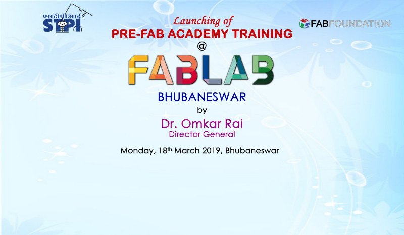
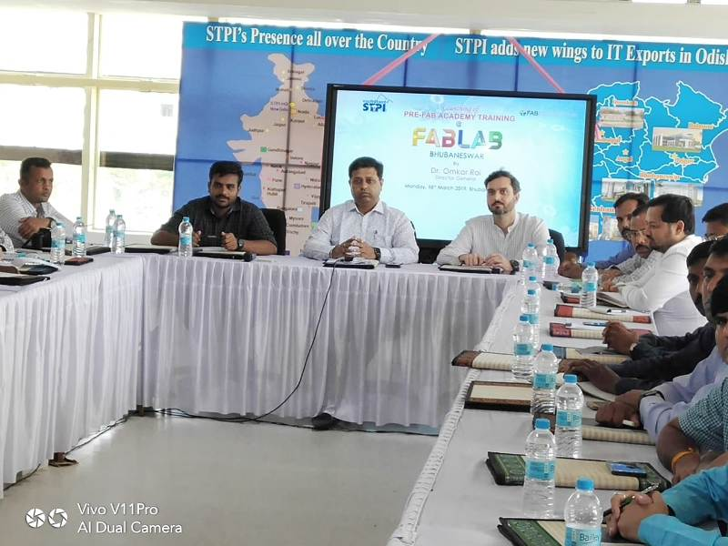
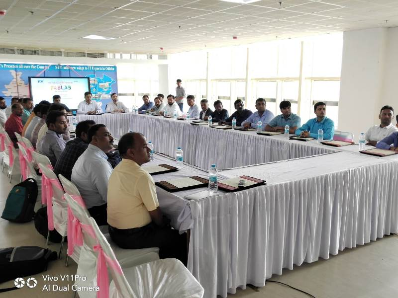
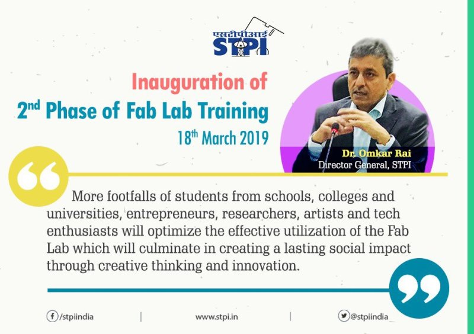
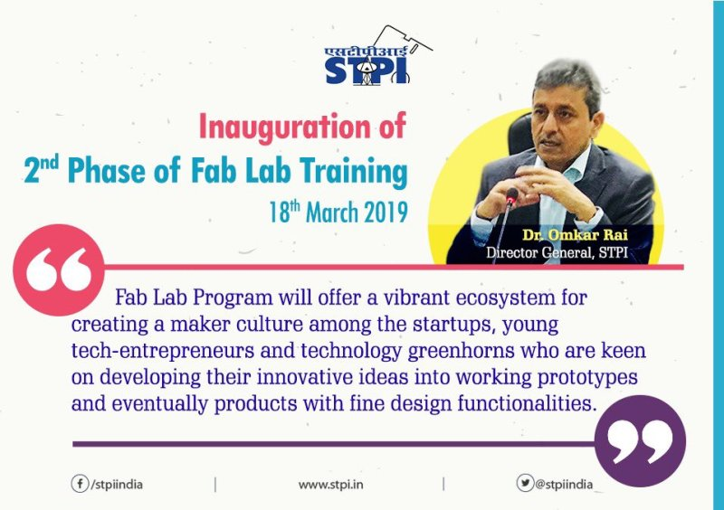

## INTRODUCTORY DAY-1 (DATE - 18.03.2019)

Introduction was provided by Shri Manas Panda (Director- STPI Bhubaneswar)about newly set-up FAB LAB in Bhubaneswar at 11:00 am followed by brief of the training to be provided to the participants by Mr. Fransisco.

Further, Dr. Omkar Rai (Director General- STPI) motivated the participants from STPI Centres across pan India to give the best during the training and be a brand ambassador for FAB Labs to be executed across the country in future.

## Message by Director General STPI w.r.t Fab Lab- STPI Bhubaneswar

Mr. Fransicso started the training session at 12 noon. The participants were informed about the objectives of the training and the basic knowledge of FAB Labs. The safety associated with FAB Lab along with the do's and dont's were also informed to the trainees.

Further, after lunch FAB Lab established at STPI Bhubaneswar was visited.
All the equipments installed were demonstrated and working of the equipments were briefed.

Methods for fabrication are either additive in nature or substractive in nature. Both kind of fabrication tools are installed in FAB Lab.

 