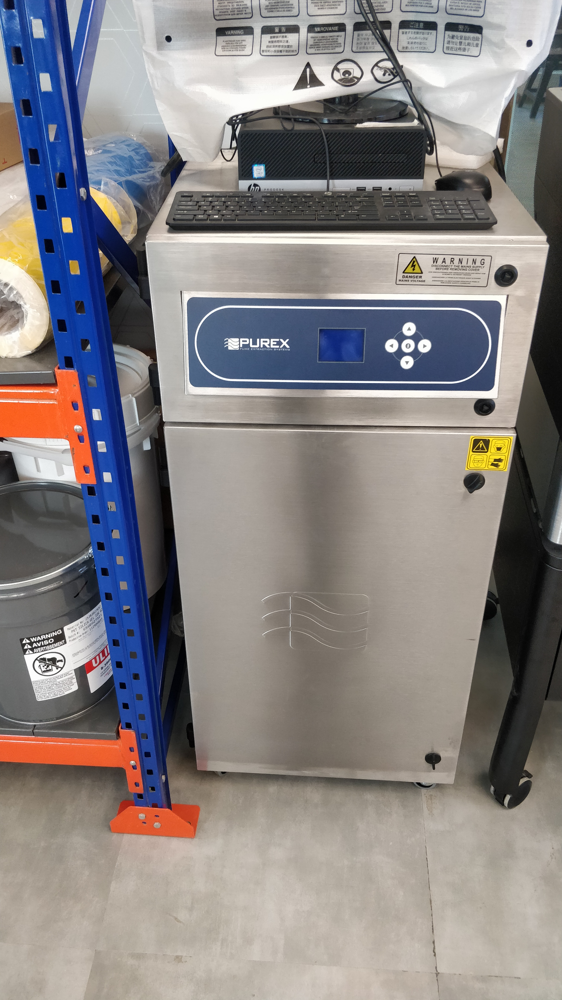

## Laser Cutter:-

Laser cutting is a technology that uses a laser to cut materials, and is typically used for industrial manufacturing applications, but is also starting to be used by schools, small businesses, and hobbyists. Laser cutting works by directing the output of a high-power laser most commonly through optics. The laser optics  are used to direct the material or the laser beam generated. A typical commercial laser for cutting materials involved a motion control system to follow a CNC or G-code of the pattern to be cut onto the material. The focused laser beam is directed at the material, which then either melts, burns, vaporizes away, or is blown away by a jet of gas,leaving an edge with a high-quality surface finish.

There are two processes by which fabrication is done through Laser cutters:-
   (i) Vector Cut
   (ii) Raster Engrave

These two operations are performed by the laser cutter. It the design has been specified with 0.1 mm thick line, the laser cutter will cut the portions and if the design has been specified with line thicker than 0.1 mm, it will engrave the portion.

# Process:-

Generation of the laser beam involves stimulating a lasing material by electrical discharges or lamps within a closed container. As the lasing material is stimulated, the beam is reflected internally by means of a partial mirror, until it achieves sufficient energy to escape as a stream of monochromatic coherent light. Mirrors or fiber optics are typically used to direct the coherent light to a lens, which focuses the light at the wor
k zone. The laser is then imposed which burns away a portion of material when it cuts through. This is known as the laser kerf and ranges from 0.08mm – 1mm depending on the material type and other conditional factors.If the laser is placed too close or too far the focus would not be correct and hence the cut or engraving would not be proper.The power and speed of a laser cutter can be controlled in percentage. For example in the process of cutting 3 mm vinyl, 60% power and 20% speed can be used. Any material which is natural and not man made can be cut or engraved through a laser cutter. The cut and engrave process can be selected by colours as well.

# Safety and Precautions:- 

Since the fabrication process involves laser, the safety and precautions while working on a laser cutter is most important. Some safety precautions are briefed below:-

 (i) Since the operations are done through lasers, fire is major source of accidents associated with Laser cutters. Hence, as soon as flames are observed during fabrication the user must immediately push the emergency stop button, push back the lens which is directing the laser, pull of the safety blanket attached near the Laser Cutter and put it over the laser cutter to put off the fire. One must always ensure prior to working on laser cutter that, the safety blanket should be well placed near the laser cutter.

 (ii) Before using a laser cutter be sure you have been trained by a qualified individual. A written procedure covering laser cutter use is recommended.

 (iii) Always follow the manufacturer’s instructions when operating a laser cutter.

 (iv) A fire extinguisher should be mounted on the wall near the laser cutter.

 (v) Regular vacuuming of the cutting deck and internal cavity of the laser cutter is very important.

 (vi) Some materials such as PVC produce hydrogen chloride gas which is extremely dangerous. If you are unsure if your material is safe to cut, the operation should not be executed.

 (vii) Never leave an operating laser cutter unattended.

 (vii) Avoid placing laser cutters on wooden surfaces.

 (viii) The lid of the laser cutter while fabrication should be always closed so that the laser beam done not escape the laser cutter.

 If the laser cutter is being used in a closed environment, the purifier of the laser cutter is very important. The purifier  

It is a 3-axis equipment and uses substractive method of fabrication. The laser cutter used in FAB Lab Bhubhaneswar is CO2 compliant, 80 watts Laser Cutter. The material which can be processed in laser cutter are relatively soft in nature like plastic sheets. The hard metals can be marked using lasers but cannot be cut. The laser cutter is attached with a 3 way filter which filters the large particles in the first stage,      other minute particles in the second stage and gases in the third stage after which it can be diffused in the open air. This 3 way filter is used with the Laser cutter if the laser cutting has to be done in a closed environment. 

Laser Cutter-

Laser Cutter Purifier- 

