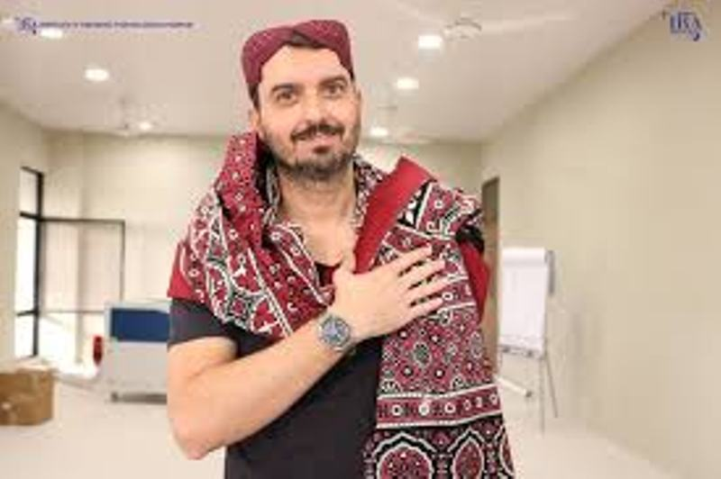

# Mentors at Fab Lab-STPI Bhubaneswar

## Francisco Sanchez Arroyo 

Having a Civil Engineering educational background with passion for tall buildings and structural engineering, Francisco Sanchez took the Fab Academy course in Fablab Barcelona. He is presently setting-up Fab Lab at STPI Bhubaneswar.

## Sibu Saman

Had completed Integrated M.Sc in Physics from UM-DAE CBS with INSPIRE Scholarship, specialized in computational and experimental physics. Completed FabAcademy in 2016. He is working with Francisco for setting-up Fab Lab at STPI Bhubaneswar.