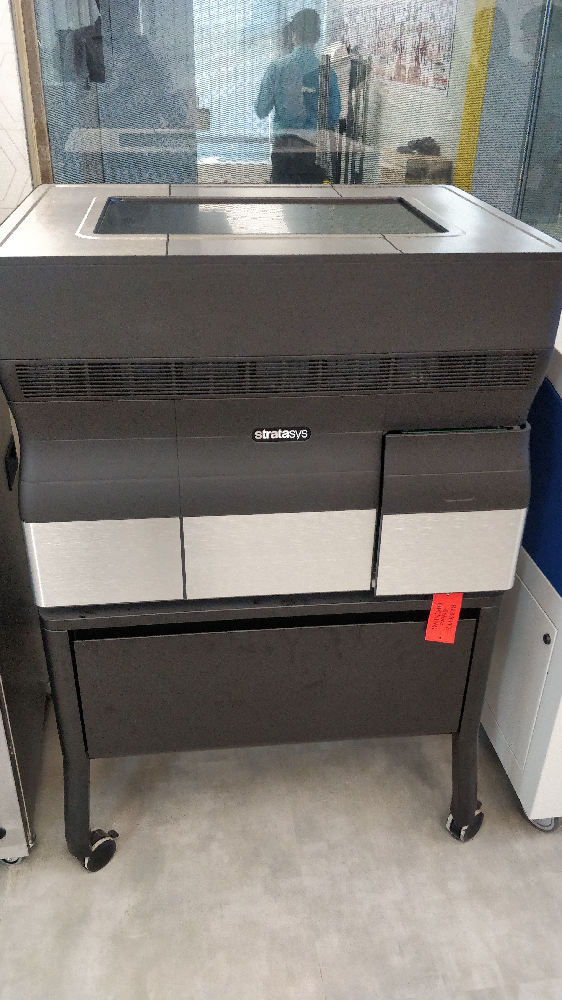

## Poly Jet 3D Printer

PolyJet printing is a rapid prototyping process that uses additive manufacturing. The printers have two or more jetting heads (one set for the model and one set for the support material) that spray outlines of the part, layer by layer.It is a powerful 3D printing technology that produces smooth, accurate parts, prototypes and tooling. With microscopic layer resolution and accuracy down to 0.1 mm, it can produce thin walls and complex geometries using the widest range of materials available with any technology.

It is a 2 axis machine which fabricates in 2 dimensions. A PolyJet 3D printer works like an inkjet printer. Instead of jetting drops of ink, the printer jets drops of photopolymer that solidify when exposed to UV light. These layers accumulate on the build tray until the part is complete.

The liquids used are photopolymers, which get cured nearly instantly by a UV lamp within the printer, creating a solid, plastic-like model that is precise and accurate. The support material is a gel-like substance, which is easily washed away.
The model made by Poly jet printers have smooth finish which makes them  ready for sanding, painting, drilling, or tapping.

### Benefits of PolyJet 3D      Printer:

  (i) Create smooth, detailed prototypes that convey final-product aesthetics.

  (ii)Produce accurate molds, jigs, fixtures and other manufacturing tools.

  (iii) Achieve complex shapes, intricate details and delicate features.

  (iv) Incorporate the widest variety of colors and materials into a single model for unbeatable efficiency.

  