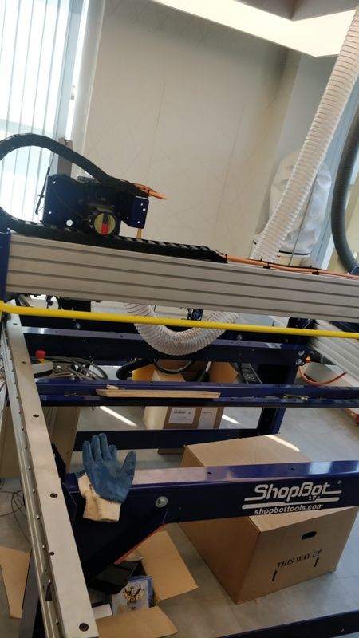
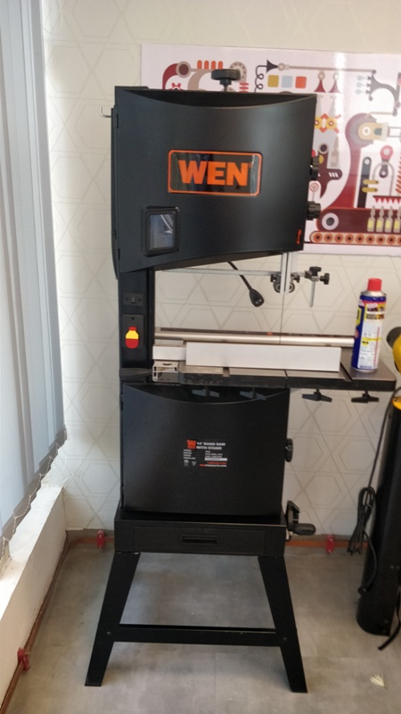
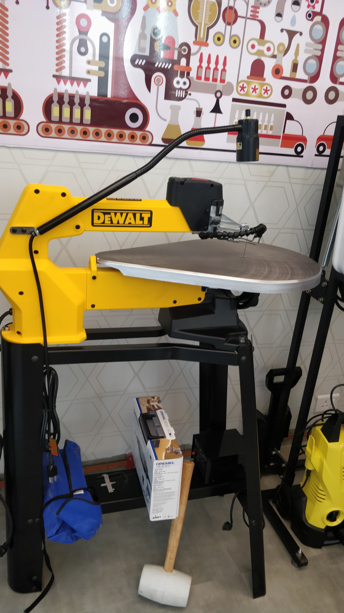
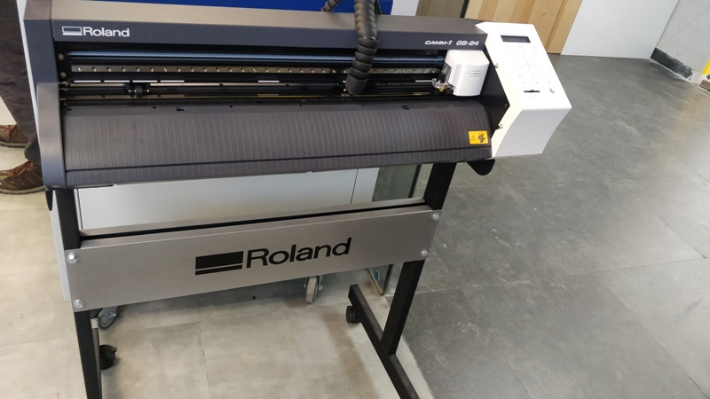
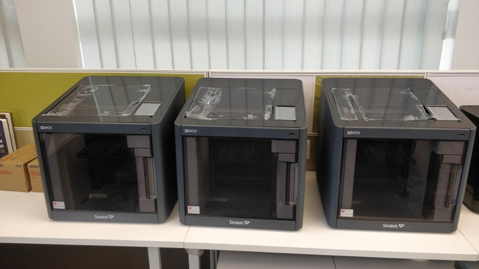
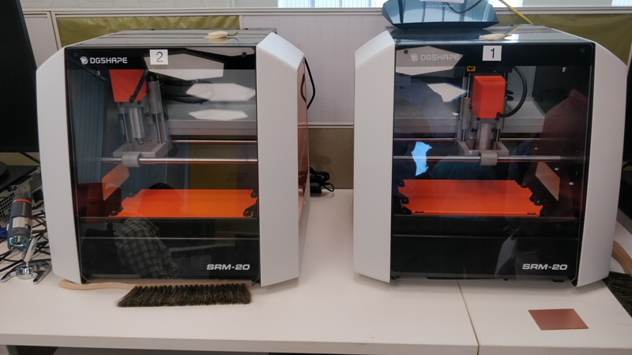
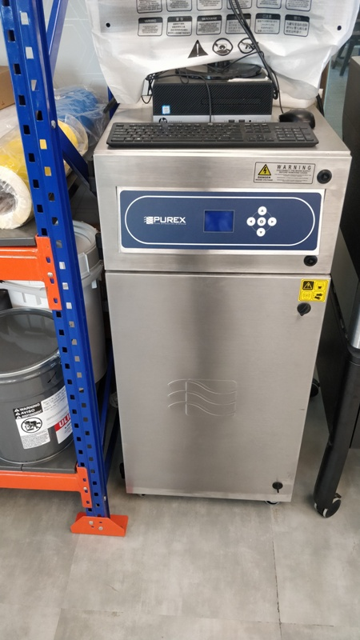

# SANDEEP NAIR (STPI BHOPAL)
## INTRODUCTORY DAY-1 (DATE - 18.03.2019)
*Mentors for the FAB LAB- Mr. Fransicso and Mr. Shibu.

Introduction provided by Shri Manas Panda (Director- STPI Bhubaneswar)about newly set-up FAB LAB in Bhubaneswar at 11:00 am followed by brief of the training to be provided to the participants by Mr. Fransisco.

Further, Dr. Omkar Rai (Director General- STPI) motivated the participants from STPI Centres across pan India to give the best during the training and be a brand ambassador for FAB Labs to be executed across the country in future.

Mr. Fransicso started the training session at 12 noon. The participants were informed about the objectives of the training and the basic knowledge of FAB Labs. The safety associated with FAB Lab along with the do's and dont's were also informed to the trainees.

Further, after lunch FAB Lab established at STPI Bhubaneswar was visited.
All the equipments installed were demonstrated and working of the equipments were briefed.

Methods for fabrication are either additive in nature or substractive in nature. Both kind of fabrication tools are installed in FAB Lab.

Equipments under substractive method of fabrication and their working are discussed below:-

(i) CNC (Computer Numerical Control) Machine- CNC is a machine which operates in 3 dimensions. The basic operation of CNC is to             fabricated wooden material or any other soft material which can hold its shape during the process of fabrication. It contains a         milling bit which as per the programming assigned provides the required shapes in all the three dimensions. The CNC installed at FAB     Lab is of Shop bot make and its dimensions are 96 inches x 48 inches. CNC is attached with a dust collector which during the process     of fabrication collects the dust emitted from the material under fabrication.

(ii) Band Saw- It is an equipment used for simple cutting. The blades used in Band Saw are thick in size and are used for normal cutting      of materials which can hold its shape during the process of fabrication.

(iii) Scroll Saw Cutter:- It is used for providing curved shapes to the materials under fabrication. The blade used is very thin in size       due to which it has the capability to provide the required shape to the materials.

(iv) Apart from this, cleaning tools were also installed in FAB Lab which is used for cleaning the devices with high water pressure.

(v) Vinyl Cutter:- This equipments is used by various signage and logo making companies. Vinyl sheet is inserted into the cutter and as       per the programming it cuts the vinly sheet. The blade attached to the vinyl cutter is either operation or not in operation. There       is no intermediatery mode of working.

(vi) Laser Cutter:- It is a 3-axis equipmentThe laser used in FAB Lab Bhubhaneswar is CO2 compliant, 80 watts Laser Cutter. The material      which can be processed in laser cutter are relatively soft in nature like plastic sheets. The hard metals can be marked using            lasers but cannot be cut. The laser cutter is attched with a 3 way filter which filters the large particles in the first stage,          other minute particles in the second stage and gases in the third stage after which it can be difussed in the open air. This 3 way      filter is used as the Laser cutter installed in FAB Lab id working in a closed environment.

Equipments under additive menthod of fabrication and their working are discussed below:-

(i) 3-D Printers:- The make installed at FAB Lab is Sindoh. It is a basic 3-D printer which works on the principle of Fused Fillament       Deposition. It is a device which works on 3 axis and provides the required shape by the means of deposition of the material used for     printing.

(ii) Stereo Lithography Printer- The raw material used in this printer is Liquid resin. Printing is done through laser as the plastic        used for fabrication solidifies when light is brought in contact at the required locations through programming.

(iii) Ink Jet Printer or Poly jet Printer:- It is a 2 axis machine which fabricates in 2 dimensions. 

The first day of the training concluded. Looking forward to hands-on experience on the equipments installed at FAB LAB- STPI Bhubaneswar on Day-2 (19.03.2019). 

**Training of Day-1 ends............

# FAB LAB TRAINING - DAY-2 - 19/03/2019

The day started with setting up PCs for uploading the changes in the Repository on Web. The process changes done in the local PC through Visual Source Code (VSC) and its process for synchronization on web was discussed in the starting session. For performing editing and other functions several tools are available under extension tab. The basic extension installed was Code Spell Checker ver 1.6.10. Many other extensions are also available which can be installed as per requirement. 

Further, the process of cloning was demonstrated in which the changes made in the VSC had to be backed-up in PC.

The step-by-step process for synchronizing the local PC and web is as under:-

(i) Any changes done or the text written in the VSC has to be saved by pressing CTRL+S.

(ii) Further the changes saved could be seen in the lest side of the screen under source control. The symbol indicates the number of changes which are to be incorporated.

(iii) Then the changes to be done has to be provided with commit on each occasion the changes are done.

(iv) Further, the changes are to be tick marked which is available at SOURCE CONTROL:GIT

(v) Then the changes done are to be pushed to the web using 3 dots available in the same section.

## Uploading of Images

## CNC Machine

## Band saw

## Scroll Saw

## Vinyl Cutter

## 3 D Printer

## Stereo Lithography Printer

##Laser Cutter & Cleaner

