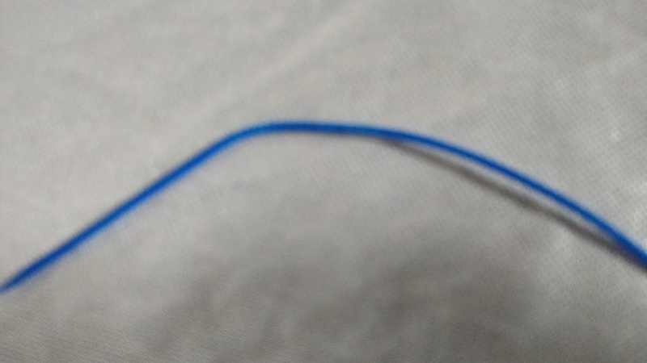

# **CONTENT**  

# [1. Self Introduction](selfintroduction.md)

# [2. Mentors at Fab Lab- STPI Bhubaneswar](mentors.md)

# [3. Introduction to FAB Lab, STPI Bhubaneswar](intro-to-fab-lab.md)

# [4. Setting-up for hands-on in Fab Lab](setting-up.md)

# 5. Equipments under Subtractive Method of Fabrication

## [(i) CNC (Computer Numerical Control) Machine](cnc.md)

## [(ii) Band Saw](band-saw.md)

## [(iii) Scroll Saw](scroll-saw.md)

## [(iv) Cleaner](cleaner.md)

## [(v) Vinyl Cutter](vinyl-cutter.md)

## [(vi) Laser Cutter](laser-cutter.md)

## 6. Equipments under additive method of fabrication

## [(i) 3D Printer](3d-printer.md)

## [(ii) Stereo Lithography Printer](stereolithographyprinter.md)

## [(iii)Ink Jet Printer](inkjetprinter.md)

 

## Uploading of Images

## Vinyl Cutter

## 3 D Printer

## Stereo Lithography Printer

## Laser Cutter & Cleaner

## Experiment-1 - 3-D Printing

Further, hands-on 3D Printers was done by a team of 10 members. The 3 D printer used was 3D WOX (Sindho). During the practical, the basic operation of the 3D printer was demonstrated. On the touch scree panel 4 options were available like cartridge, print, settings and info. Initially the process of cleaning and maintenance to 3D printer was demonstrated. The cartridge used in 3 D printer is PLA (Poly Lactic Acid). While performing the maintenance of the 3D printer the PLA has to be removed from the printer which was done by the team. The cartridge contained a wire of PLA rolled in it. 

## PLA Roll

The rolling of the wire in the cartridge has to be done in such a way that there is proper tension in the roll. During the maintenance of the roll of the cartridge, the team was informed that, if any bend was found in the PLA, that portion might not provide a proper printing. The team during the maintenance of the PLA found a bend and that small portion of the bend was removed from the roll.

## Bend Piece of PLA Roll

 Further the roller was fitted into the cartridge. It is worth noting that, while fitting the roll in the cartridge any part of the roll should not be out of the cartridge. The cartridge was the inserted in the 3D printer. Further, a section were the collection of wasted PLA which the roller uses for self cleaning was demonstrated and the process to clean it was shown. The cartridge is attached with a chip which contains all the information about the cartridge like length of the roll, color and physical properties of the filament. The diameter of the filament in the cartridge was 1.75 mm.

The device was not ready to print. The team was asked to print anything which can be of useful nature. The team decide to produce a clip which can be able to holed the loose roll of PLA in the cartridge when it is not in use. The team found the image of the clip on the website which was downloaded and further was sliced using Sindoh software. Proper orientation of the clip was selected and the item was processed to be printed on the 3D printer. The team performed the task and the first test product of FAB Lab, STPI Bhubaneswar was produced.

## Fabricated PLA Roll Clip produce by 3D Printer

## Experiment-2 - Vinyl Cutting

Further, Vinyl Cutter was demonstrated to the set of participants. The raw material used in the Vinyl Cutter is the Vinyl Sheet. This equipment is used by companies working in the field of signage and logo designing. The vinyl roll has to be properly placed between the rollers installed in the cutter. Further, there are some vertical line according to which the vinyl roll can be set-up in the cutter. For fixing the roll, it has to be place in the white section were the tube is having a rough surface soo that the grip is good. The user should also keep in mind that the vinyl is fixed at a position were there is minimum loss of vinyl sheet. Through this process the user can minimize the wastage of the vinyl sheet.

** The Second Day of the FAB Lab training commenced **

