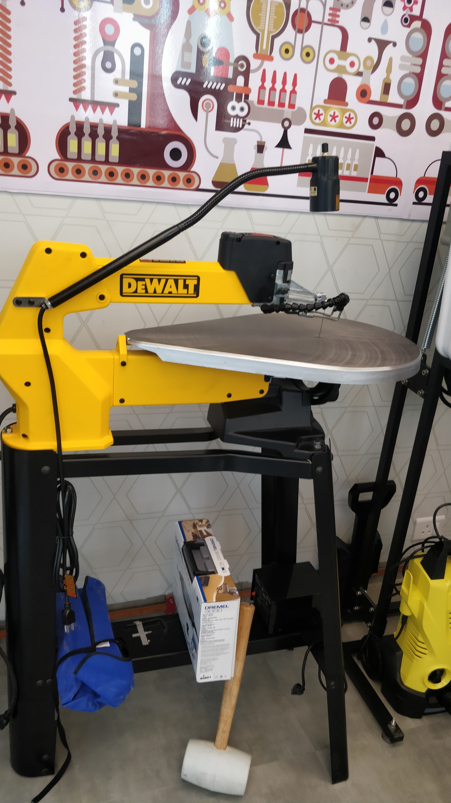

# **Scroll Saw Cutter:-**  

A scroll saw is a small electric or pedal-operated saw used to cut intricate curves in wood, metal, or other materials. The fineness of its blade allows it to cut more delicately and more easily. 

It is used for providing curved shapes to the materials under fabrication. The blade used is very thin in size due to which it has the capability to provide the required shape to the materials.

While somewhat similar to a band saw, a scroll saw uses a reciprocating blade rather than a continuous loop. The scroll saw's blade can be removed and placed through a pre-drilled starting hole, allowing interior cutouts to be made without an entry slot. Also, the fineness in both width and tooth count of a scroll's blade permits significantly more intricate curves than even the narrowest gauge band-saw blade.

The majority of scroll saws offer a small light on a flexible arm that illuminates the work area and a dust blower nozzle to keep the work space clear while working. Table-tilting enables angled cuts to be made precisely and easily. Variable-speed support allows even finer control over cuts when working with delicate materials or when making intricate cuts.

Scroll sawing is a popular hobby for many woodworkers. The tool allows a substantial amount of creativity and requires comparatively little space. In addition, many scroll saw projects require little more than the saw itself, reducing the investment in tools. A drill is required for interior cutouts, preferably a drill press for finely detailed work.

Scroll saws are often used to cut intricate curves and joints, a task they can complete quickly and with great accuracy. They can also be used to cut dovetail joints and are a common tool for thicker intarsia projects. When a fine blade is used, the kerf of a scroll saw is all but invisible.

Along with band saws,  scroll saws are used with modern intarsia.

Scroll saws are comparatively safe. In particular, inadvertent contact between the blade and the operator's fingers or limbs is unlikely to result in serious injury, due to a smaller blade and relatively slower speed compared to tools such as a table saw.

