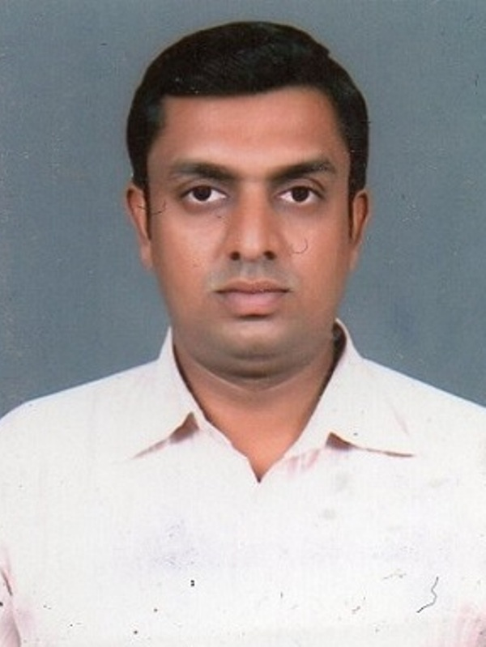

# SANDEEP NAIR (STPI BHOPAL under STPI Noida Directorate)

Hello Everyone!!!!

I am Sandeep Nair. I belong to STPI Bhopal which is a sub-centre under STPI Noida Directorate. My name was proposed for the training in FAB LAB at STPI Bhubaneswar and I am very thankful to my officials for providing me such a great opportunity to attend the training.

My qualifications are B.Tech (Electronics and Telecommunication) which I have completed in year 2007. I joined STPI in year 2008 January as a Project Associate at STPI Bhopal Centre. 

I initially worked in MPSWAN (Madhya Pradesh State Wide Area Network) Project. STPI was appointed as Technical Consultant for the project. The major objective of the project was to provide a network to all the government offices in the State of Madhya Pradesh so that easy and seamless propagation of Video, Voice and Data across all the government offices can be enabled. I was a part of the team from STPI providing the technical consultancy to MPSWAN Project. The responsibility of STPI in the project was as mentioned below:-

(i) Preparation of RFP.

(ii) Providing technical solutions to be implemented in the network.

(iii) Technical evaluation of the bidders. 

(iv) Selection of implementing agency through tendering.

(v) Monitoring the implementation of MPSWAN Project.

(vi)Performing Final Acceptance Test (FAT) of MPSWAN Project with the State Government.

 Further, I was involved in the project of STPI Bhopal Construction work. My responsibility in the project was to coordinate with local government authorities for statutory approvals, coordination with NBCC (the implementing agency) regarding progress of the project, Updating my officials regarding the progress of the project. STPI Bhopal construction project was completed in month of November,2017 and operations at STPI Bhopal Centre were initiated soon after.

 Presently, I am looking after Incubation, Datacom Services or any other work at STPI Bhopal Centre. I am also promoting IBPS in Bhopal and near-by region. 

 Further, we have initiated preliminary collaboration with the State Government of Madhya Pradesh for creation of Centre of Excellence (CoE) and Fab Lab in the State of Madhya Pradesh. Hopefully, we can materialize the upcoming projects in the near future.

 
 