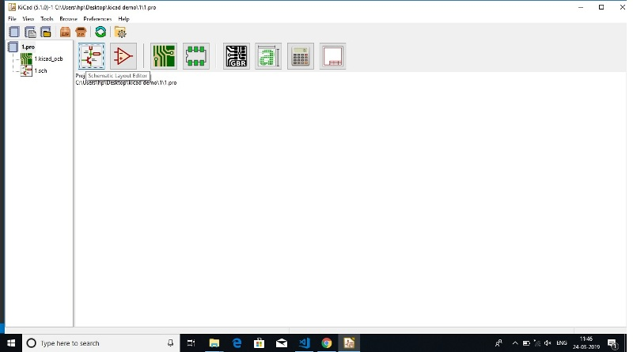
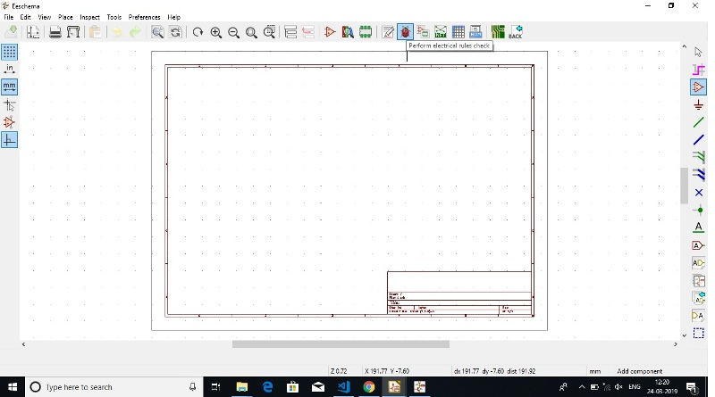
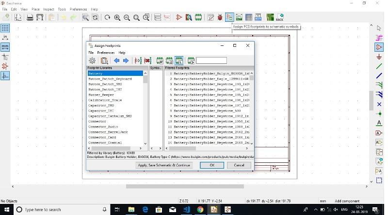
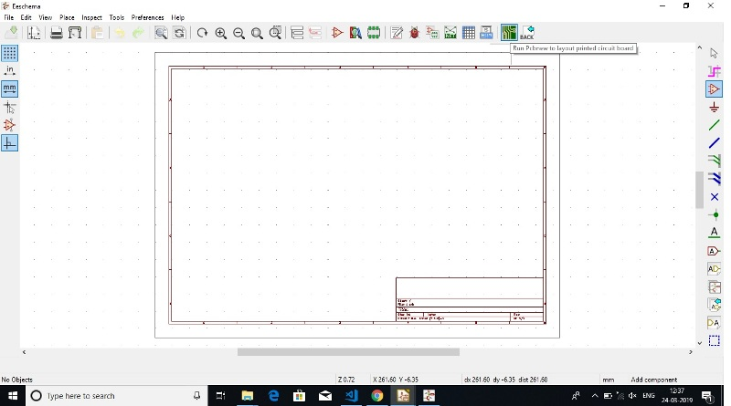
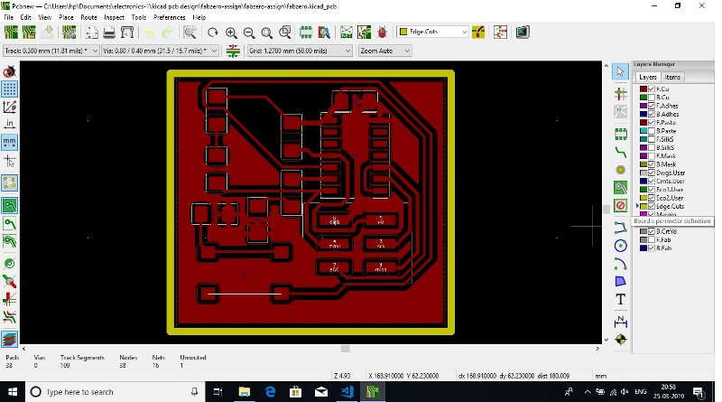

## Stereo Lithography Printer (SRM-20)

It is a form of 3D printing technology used for creating models, prototypes, patterns, and production parts in a layer by layer fashion using photochemical processes by which light causes chemical monomers to link together to form polymers. Stereolithography can be used to create things such as prototypes for products in developing computer hardware, as well as in many other applications.

Stereolithography is an additive manufacturing process that, in its most common form, works by focusing an ultraviolet (UV) laser on a photopolymer resin (Liquid resin).With the help of computer aided manufacturing or computer-aided design software (like KiCad in our case) , the UV laser is used to draw a pre-programmed design or shape on to the surface of the photopolymer. Photopolymers are sensitive to ultraviolet light, so the resin is photo chemically solidified and forms a single layer of the desired 3D object.Then, the build platform lowers one layer and a blade recoats the top of the tank with resin. This process is repeated for each layer of the design until the 3D object is complete. Completed parts must be washed with a solvent to clean wet resin off their surfaces.

The design is made on the computer aided software and is made ready to be printed on the Stereo Lithography Printer. The operation of Stereo Lithography Printer is in 3 dimensions. A base is attached at the bottom which moves in a vertical axis on top of which copper plate is mounted. The print platform lowers itself into the resin glass tank, an ultraviolet laser light, from underneath the see-through tank, shines on it.  Exposed to the laser light, the resin cures, solidifies and sticks to the platform. As more resin is exposed to the laser light, the pattern is created and joins the layer above. As more and more layers are being created, the build platform slowly moves upward, finally pulling the entire object out of the tank as the print process is finished.

Stereolithography is often used for prototyping parts at a relatively low price. Stereolithography can produce accurate prototypes, even of irregular shapes. One can use those prototypes to assess the design of their product or as publicity for the final product.

## Experiment- Designing prototypes and printing in Stereo Lithography Printer.

The aim of the experiment was to design a personalized design to be printed in a Stereo Lithography Printer. The software used for designing the prototype for the experiment was Kicad. It is a software which assists in making the desired designs. For designing kicad is used in following steps:-

(i) Open the kicad software and start a new project.

(ii) The PC would ask for the location of the project. It should be kept in mind that all the kicad designs and supporting documents are to be kept in a single folder for ease of operations.

(iii) Once the location is selected open kicad Schematic layout editor to start designing new schematic.

(iv) On starting the new schematic a new window would be opened named 'Eeschema'. On which on the right side of the screen there is a symbol named 'place symbol'.

(v) One after clicking the 'place symbol' icon and clicking on the screen a panel for selecting the item would appear through which the items required for the designing the prototype may be selected.

(vi) I had designed the following prototype:

(vii) After thr prototype is designed it is a required to annotate schematic symbols using the following option.

(viii) After Annotating the schematic, there is a symbol for 'performing electrical rule check' which confirms the proper electrical connections in the schematic.

(ix) The next set is to 'Assign Foot Prints' to the schematic made

(x) The next step is to generate 'Net List' and save it is the same folder prepared for the project.

(xi) Further, the design is forwarded to be processed for "layout design for Printed Circuit Board of the schematic designed.

(xii) Further the schematic diagram has been imported to the PCB designing and my prototype was ready to be printed.

(xiii) After finishing the design of the PCB, on the right side of the panel, there is an option of edge cut. Along with that, option of adding graphic line has to be selected so that the border of the PCB design can be created. The dimension of the border has to be 0.8 mm which is selected according to the milling bit. 

(xiv) Once the boundary is created, this can be saved through file by plotting command. While selecting the same there would be some options to select out of which F.Cu and Edge.cuts has to be marked. The plot format has to be saved in .svg format. Further, under the general options 'exclude pad from silk screen ' and 'negative plot' has to be ticked leaving all the other as unchecked.

(xv) After the above step the plot can be save in .svg format in the folder were the designing of the PCB has been done. Two .svg images would be saved on the location as mentioned by the user. For the ease of operations, it is recommended that the images may be save in the same folder were all the other operations of the designing part has been done.

(xvi) The image has to be exported in .png format at 2000 dpi for clear picture. Further, for printing the image of circuit board the .png image has to be converted into .rml format.

*Note:- (i) The white portion in the png image would be kept and black portion would be removed.
   
        (ii)The general rule of milling in Stero Lithography Printer is that if the diameter of milling bit is 0.8 mm, the milling bit will go on till0.4 mm down in the Z-axis towards the plate in which the PCB board is printed. 

(xvii) For converting the image in .rml format, http://fabmodules.org/ is used. While browsing on the website initially the input format has to be selected. Which in our case would be the .png file converted for preparing the traces and cuts. On selecting the image, it would further ask for output which has to be selected as Rolland mill (.rml). Further it would ask for the process which is to be selected as PCB Traces (1/64).

(xviii) Once the above process is complete, the specifications of the print has to be selected on the right side in the panel were input and out put has to be selected. For getting a clear print. the dpi has to be selected as 2000 dpi in the input. Under the same head, we can see the size of the image as well which is 31.293 x 28.753 mm (ie. approx. 3 x 3 cms)in our case.

(xix) Further, the output of the machine has to be selected which is SRM-20 in our case with       4 mm/s speed, x0, y0 and z0 set at 0 and zjog set to 2 mm. Zjog is the maximum distance the milling bit will move from the frame in z direction.

(xx) After completing the above set up, we have to calculate and save the same.

(xxi) The process has to be done for both .png file of traces and cuts and has to be exported in .rml file prior to printing. 

(xxii) While printing first the traces would be printed following with the cut after which the printed pcb cab be removed from the SLP.
