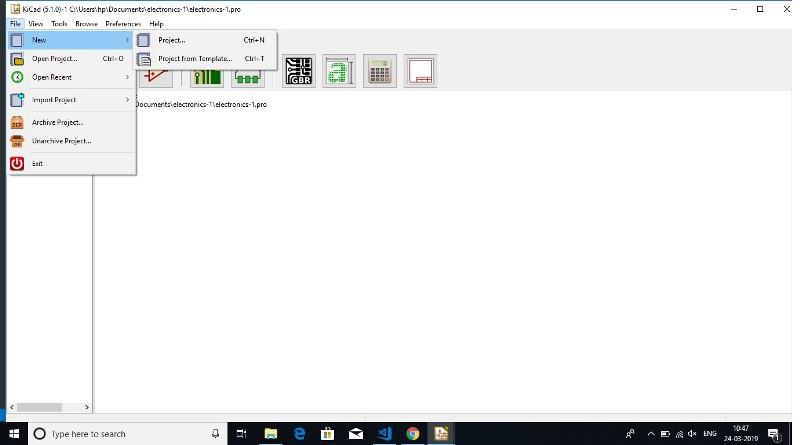
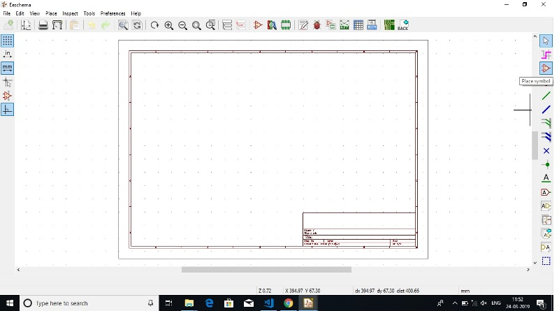

## Stereo Lithography Printer (SRM-20)

It is a form of 3D printing technology used for creating models, prototypes, patterns, and production parts in a layer by layer fashion using photochemical processes by which light causes chemical monomers to link together to form polymers. Stereolithography can be used to create things such as prototypes for products in developing computer hardware, as well as in many other applications.

Stereolithography is an additive manufacturing process that, in its most common form, works by focusing an ultraviolet (UV) laser on a photopolymer resin (Liquid resin).With the help of computer aided manufacturing or computer-aided design software (like KiCad in our case) , the UV laser is used to draw a pre-programmed design or shape on to the surface of the photopolymer. Photopolymers are sensitive to ultraviolet light, so the resin is photo chemically solidified and forms a single layer of the desired 3D object.Then, the build platform lowers one layer and a blade recoats the top of the tank with resin. This process is repeated for each layer of the design until the 3D object is complete. Completed parts must be washed with a solvent to clean wet resin off their surfaces.

The design is made on the computer aided software and is made ready to be printed on the Stereo Lithography Printer. The operation of Stereo Lithography Printer is in 3 dimensions. A base is attached at the bottom which moves in a vertical axis on top of which copper plate is mounted. The print platform lowers itself into the resin glass tank, an ultraviolet laser light, from underneath the see-through tank, shines on it.  Exposed to the laser light, the resin cures, solidifies and sticks to the platform. As more resin is exposed to the laser light, the pattern is created and joins the layer above. As more and more layers are being created, the build platform slowly moves upward, finally pulling the entire object out of the tank as the print process is finished.

Stereolithography is often used for prototyping parts at a relatively low price. Stereolithography can produce accurate prototypes, even of irregular shapes. One can use those prototypes to assess the design of their product or as publicity for the final product.

## Experiment- Designing prototypes and printing in Stereo Lithography Printer.

The aim of the experiment was to design a personalized design to be printed in a Stereo Lithography Printer. The software used for designing the prototype for the experiment was Kicad. It is a software which assists in making the desired designs. For designing kicad is used in following steps:-

(i) Open the kicad software and start a new project.

(ii) The PC would ask for the location of the project. It should be kept in mind that all the kicad designs and supporting documents are to be kept in a single folder for ease of operations.

(iii) Once the location is selected open kicad Schematic layout editor to start designing new schematic.

(iv) On starting the new schematic a new window would be opened named 'Eeschema'. On which on the right side of the screen there is a symbol named 'place symbol'.

(v) One after clicking the 'place symbol' icon and clicking on the screen a panel for selecting the item would appear through which the items required for the designing the prototype may be selected.

(vi) I had designed the following prototype:

(vii) After thr prototype is designed it is a required to annotate schematic symbols using the following option.

