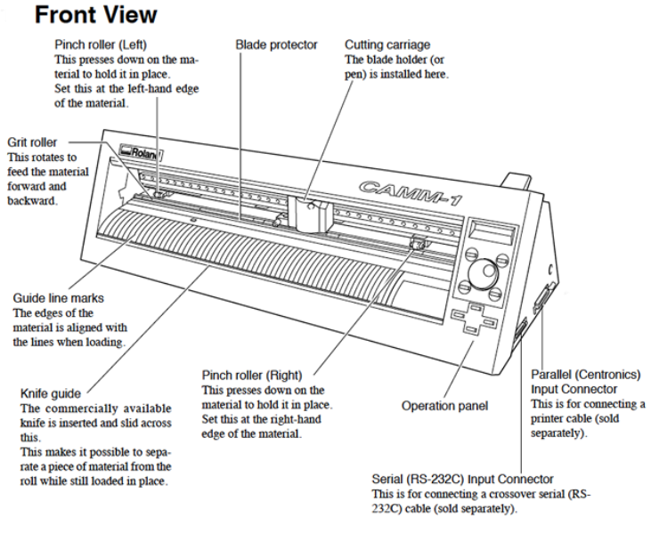
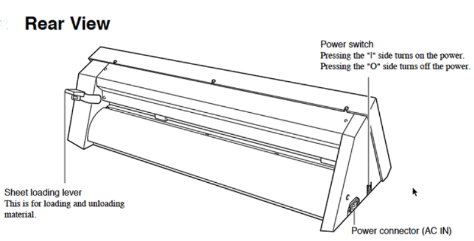
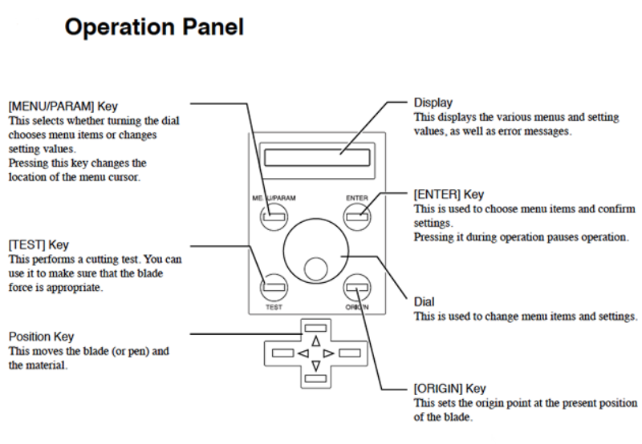
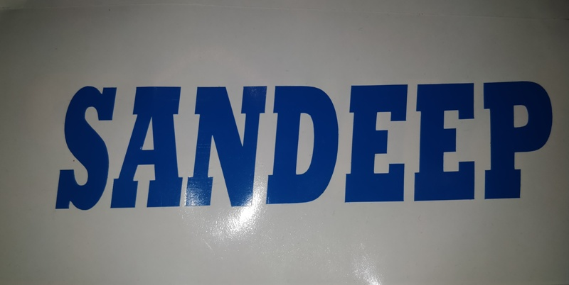

## Vinyl Cutter:- 

Vinyl Cutter is a type of computer-controlled machine. The computer attached to the printer controls the movement of a sharp blade over the surface of the material. This blade is used to cut out shapes and letters from sheets of thin self-adhesive plastic (vinyl). The vinyl can then be stuck to a variety of surfaces depending on the adhesive and type of material.

To cut out a design, a vector-based image must be created with software. We have used Inkskape for designing purpose. Further, the image or letters are sent to the cutter where it cuts along the vector paths laid out in the design. The cutter is capable of moving the blade on an X and Y axis over the material, cutting it into any shape imaginable. The vinyl sheet comes in a long roll because of which small designs or larger ones can be cut through the vinyl printer.

The one major limitation with vinyl cutters is that they can only cut shapes from solid colours of vinyl. A design with multiple colours must have each colour cut separately and then layered on top of each other as it is applied to the substrate. Also, since the shapes are cut out of solid colours, photographs and gradients cannot be reproduced with a stand alone cutter.

In addition to the capabilities of the cutter itself, the adhesive vinyl comes in a wide variety of colours and materials including gold and silver foil, vinyl that simulates frosted glass, holographic vinyl, reflective vinyl, thermal transfer material, and even clear vinyl imbedded with gold leaf. (Often used in the lettering on fire trucks and rescue vehicles.)

The blade of the cutter has to be adjusted in such a way that it cuts only the vinyl and not the adhesive sheet below the vinyl.

## Experiment- Vinyl Cutting by Roland GS-24 Vinyl Cutter

Vinyl Cutter was demonstrated to the set of participants. The raw material used in the Vinyl Cutter was a Blue colored Vinyl Sheet. Vinyl Cutter is used by companies working in the field of signage and logo designing. 

The basic set-up involved before cutting the vinyl in vinyl cutter os as follows:-

(i) A power connector is provided on the side of the vinyl cutter which is used for providing proper power supply to the vinyl cutter.

(ii) The roll on which the cutting has to be done should be placed properly between the rollers provided for the purpose in the vinyl cutter.

(iii) A sheet loading lever is attached on the back side of the vinyl cutter which is used to load and unload the vinyl roll. This lever has to be released for inserting the sheet in the vinyl cutter.

(iv) After the sheet load lever is released, vinyl sheet has to be passed through the printer in such a way that it passes through the head and base of the vinyl cutter through a small space provided in between.

(iv) Further, the passed sheet has to be aligned with the guide line marks provided in the printer so that the sheet may be aligned properly.

(v) The blade to be used for cutting the vinyl sheet is placed in the blade holder. A blade protector is also provided to protect the blade installed in the blade holder.

(vi) The vinyl sheet is placed above the grit roller which is used to feed the material forward or backward.

(vii) Further, two pitch rollers are available in the vinyl cutter which has to be adjusted on the left and the right side of the vinyl sheet so that the sheet is properly fixed.

(viii) On the grit roller, there are white colored markings were roughness is provided so that it can hold the pitch roller properly.

(ix) The vinyl sheet has to be adjusted on the grit roller and the pitch roller on the white colored marks in such a way that minimum sheet is wasted during the vinyl cutting.

(x) Then the sheet loading lever is fixed so that the vinyl sheet is fixed into the vinyl cutter.

(xi) Further, the blade holder has to be set to the origin through the operational panel provided in the vinyl cutter. The origin decides the starting point of the vinyl cutter. 

(xii) Further, the vinyl cutter is connected to the PC through which the print command is provided to the vinyl cutter.

(xiii) The vinyl cutter starts cutting from the origin provided through the operational panel.

(xiv) After the cutting is completed, the sheet loading lever is released and the sheet is rolled further till knife guide so that the sheet which is cut can be separated from the vinyl roll. It may be noted that some space may be provided above and below the design or the alphabets cut on the vinyl sheet so that it can clearly be separated from the vinyl roll.

(xv) Further the knife is inserted in the knife guide to separate the cutting done in the vinyl sheet.

*The pictures demonstrating the parts of the vinyl cutter is depicted below:-

I had designed my name on Inkscape and the same was cut on the vinyl sheet through vinyl cutter. The images of my design i.e. my name cut in the vinyl sheet through vinyl cutter is shown below.

